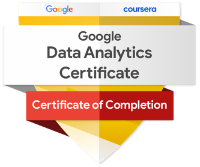

# Hi, welcome to my GitHub Portfolio! 
I'm Athena, a meticulous and data-driven professional with a background in Physics.
My journey has been marked by a passion for unraveling insights from datasets and applying them to drive informed decision-making. Having recently completed the Google Data Analytics Professional Certificate, I have acquired the best tools and techniques in data analytics, such as R, SQL, Tableau, and Excel. 

I have a particular passion for native ecosystems and natural resource management. I would love to work on environmentally-focused projects one day. I am eager to bring my diverse experience and analytical skills to a dynamic team where I can contribute meaningfully to new projects!

## 👩‍💻 About Me
* I live in Colorful Colorado 🍂
* I love everything nature, but the mountains are my favorite 🏔️
* As a challenge enthusiast, I am teaching myself Python
* Traveling is one of my favorite hobbies. I have traveled to 15 countries in Europe and visited 7 US National Parks 🌍
* [Ajax](https://github.com/Athena-Gerardo/Athena-Gerardo/blob/main/Ajax.PNG) is my best furry friend 🐾🐾

## Certifications
Google Data Analytics Professional Certificate

## Let's connect!
[LinkedIn](https://www.linkedin.com/in/athena-gerardo-635611161/)

Email: athena.gerardo@gmail.com

